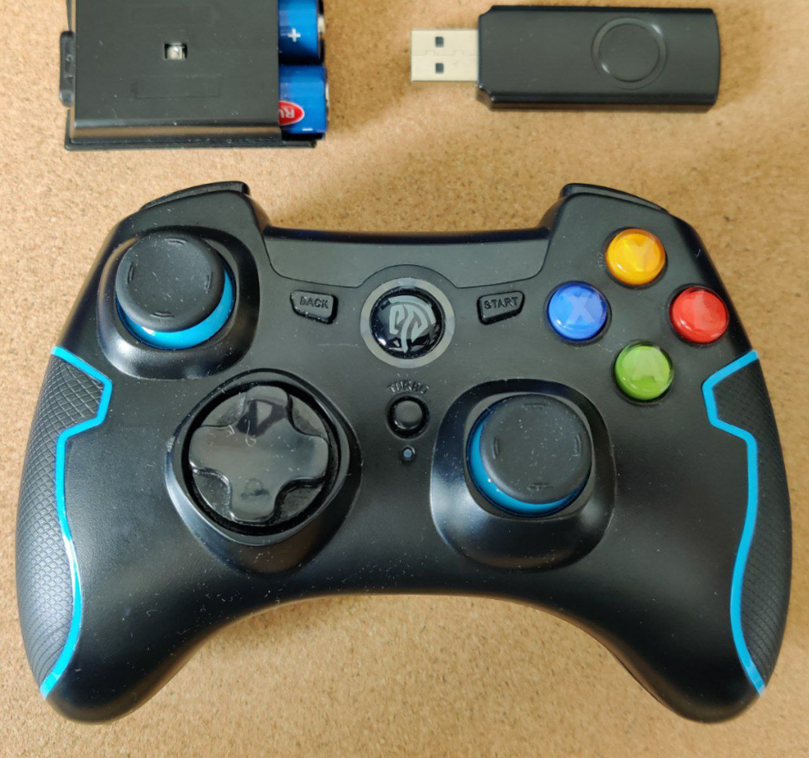

Gamepad Input Script
============

## Inputs Python Library

As a basis for developing our application, we use the ***Inputs Python Library***. The reason was the incredible flexibility and wide range of possibilities of this resource and a good feedback about the work from the community. All necessary information about the library can be pulled out of the following pages:

- [github/inputs](https://github.com/zeth/inputs)

- [zeth/inputs](https://inputs.readthedocs.io/en/latest/)

There are several reasons for using exactly this library:

- The Inputs module provides Python programs with an easy way to listen for user input.
- Currently supported platforms are Linux (including Raspberry Pi and Chromebooks in developer mode), Windows and the Apple Mac.
- Supported Python versions are all versions of Python 3 and Python 2.7
- Inputs is in pure Python and there are no Raspberry Pi, Linux or Windows dependencies.

It is also very useful when the device needs to run a particular application in full screen mode, but you would like to listen in the background for a certain set of user data, e.g. to bring up the admin panel in digital signage settings. But the most suffcient feature of the Iputs module is taht it is cross-platform, so it doesn't matter which you use, the event data will be normalized and your program will work the same on the other operating system.




## Installation


```bash
$ pip install inputs
```
or directly from source


```bash
$ git clone https://github.com/zeth/inputs.git
$ cd inputs
$ python setup.py install
```


Scroll up and down using tab-key and arrows, navigate *SSH* then *YES*, then *OK* then 
click *Finish*.

## Configuration using desktop:

Go to menu *Preferences*, choosing *Raspberry Pi configuration*. Then the corresponding GUI opens with setting options, you should select SSH via interface options and release the corresponding option.

*Images were taken from [www.raspberrypi.org](https://www.raspberrypi.org/)*

## Configuration using systemctl:

```bash
$ sudo systemctl enable ssh
```
```bash
$ sudo systemctl start ssh
```


!!! note annotate "IP-address of Rapsberry Pi" 
    
    You'll need to write down your Raspberry Pi's IP address to connect to it later. The ifconfig command displays information about the current network status, including the IP address, or you can use hostname -I to display the IP addresses associated with the device.

For connection with the *Raspberry Pi* you need to type in the following:
```bash
$ sudo pi@<IP>
```


# WiFi Connection

The tool *raspi-config* is being used also for the configuration of the wireless network to various parts of the boot, login, and networking process, as well as some other system-level changes. Wireless LAN connection is also turned on via this application as well as SSH.
The one can also configure country-specific WLAN connection via WLAN Country if it's needed.

# VNC on Raspberry Pi


In case someone likes to work on Raspberry Pi from another device by remote control, or when it is not convenient to work directly on it, VNC could solve this use case. VNC is a graphical desktop sharing system for remotely controlling one computer's desktop interface (VNC server) from another computer or mobile device (VNC viewer).

We can use RealVNC on Raspberry Pi OS, which has both VNC Server and VNC Viewer. VNC Server must be enabled before usage. In some cases, if the Raspberry Pi is headless, VNC allows us to get the GUI-access to it.

For VNC configuration we need:
Enable VNC server on command line with raspi-config:
```bash
$ sudo raspi config
```
VNC Server → Interfaces → VNC → Yes
There are two ways to connect to your Raspberry Pi. You can use one or both depending on what works best for you.
Establishment of a direct connection or a cloud connection.

### Direct Connection

In case of the direct connection, we should get the IP address of the
Raspberry Pi.Download VNC Viewer on the device you are using to take control.
For best results, use RealVNC's compatible app. Enter the private IP address
of your Raspberry Pi into VNC Viewer.

### Cloud Connection

Sign up for a RealVNC account here:
[link](https://manage.realvnc.com/en/).
It's free and only takes a few seconds.
On the Raspberry Pi, user must log in to VNC Server with the new RealVNC account credentials. Subsequently user must download VNC Viewer on the device you are using to take control. 

There must be RealVNC's compatible app. Then just sign in to VNC Viewer using the same RealVNC account credentials, afterwards either tap or click to connect to the Raspberry Pi. In both casesfor establishing either a direct or cloud connection, user must authenticate with VNC Server.

