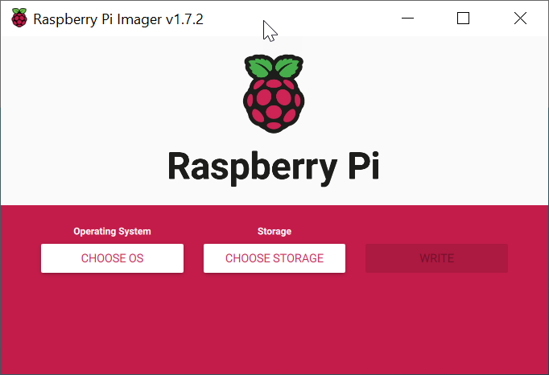
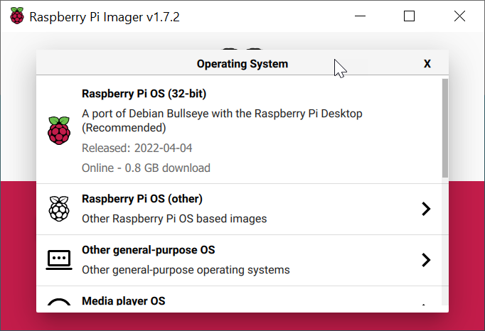
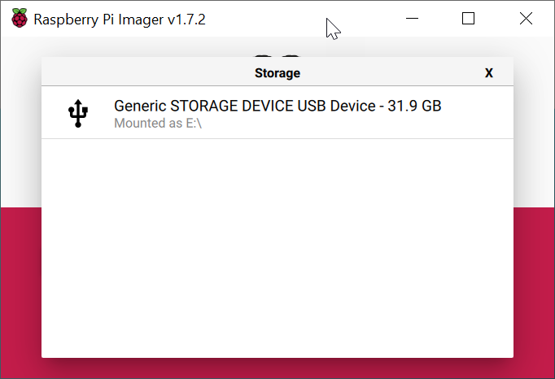

Raspberry Pi 
============

# Setup step-by-step

This document gives us a quick overview how to setup ***Raspberry Pi***. For this you need the following tools such as Micro HDMI cable, USB keyboard & mouse, SD card (for RaspberryPi Zero up to 256 GB), LAN cable for the Ethernet connection. The tools mentioned are not a must, but an optimal set for the initial configuration of the RaspberryPi.

### Installation of RaspberryPi OS
First of all, one has to install RaspberryPi Imager using the following [link](https://www.raspberrypi.com/software/).
 

*Images were taken from [www.raspberrypi.org](https://www.raspberrypi.org/)*

The current version of the operating system should then be selected using the "Choose button" button. We see several possibilities, the optimal choice would be RaspberryPi OS (32 GB).

*Images were taken from [www.raspberrypi.org](https://www.raspberrypi.org/)*

Next you have to connect the SD card to the card reader and select it as a storage medium in the image program. Then you have to start with the actual flashing after pressing the "Write" button.

*Images were taken from [www.raspberrypi.org](https://www.raspberrypi.org/)*

Damit sind wir mit dem initialen Setup von Raspberry Pi.