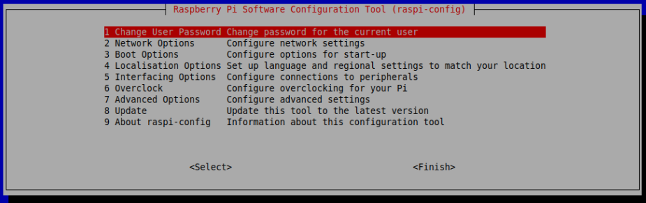

Konfiguration Raspberry Pi 
============

# SSH Verbindung

Um das Konfigurationstool auf einem Raspberry Pi zu öffnen, muss man in der Eingabeaufforderung die 
folgende Befehlszeile eingeben:

Dann öffnet sich entsprechend GUI mit Einstellungsoptionen, da soll man über Schnittstellenoptionen 
SSH auswählen und etsprechende Option freigeben. Dieser Schritt ist für die Aktivierung der SSH-Verbindung. 

!!! note annotate "IP-Adresse von Rapsberry Pi" 
    
    Sie müssen sich die IP-Adresse Ihres Raspberry Pi notieren, um sich später mit ihm zu verbinden. Mit dem Befehl ifconfig werden Informationen zum aktuellen Netzwerkstatus angezeigt, einschließlich der IP-Adresse, oder Sie können hostname -I verwenden, um die mit dem Gerät verknüpften IP-Adressen anzuzeigen.

