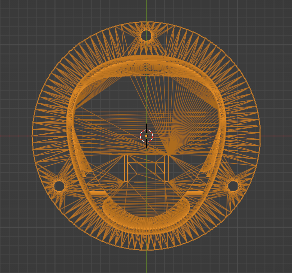
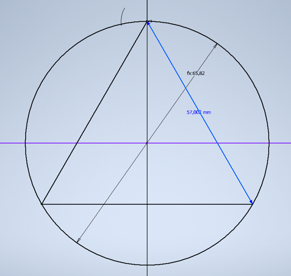
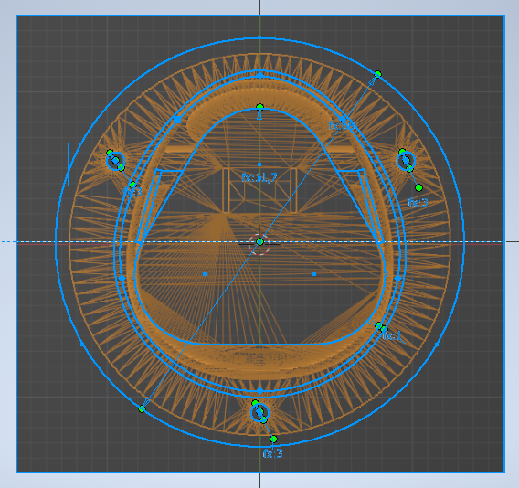

The Akkuhalter 3D Model was created with Inventor and is therefore open for extensions and refactoring.

To understand how the model has been built from ground and what the components are I will first give a brief overview of the building process of the model and then write a short description for every component.

 
<b>Building Process</b>

Measurement:

There are many ways to achieve this and I tried several, f.e. the option above.

Because it was not precise enough I used a screenshot of a stl model with Vertex-View in Blender:

I loaded it into Inventor as a Reference-Image for the vertical sketch. I recommend using it. It should now match the real dimensions.

After a lot of try and error i found a solution for constructing the triangle sketch. 

The size is determined by the diameter of the circle. The math is: `1/2 * length of sides / cos(30)` but it is coded in a transitive variable so you use the variable for the length of the sides.

Then I rounded the corners, also with a parameter ("Dreiecksabrundung"). And made an outer shape with polygons.
And finally it was all a matter of a lot of sketching and extruding.

I think it doesnt make sense to replicate each step, so for more details take a look at the components description instead.

 
 
<b>Components</b>

 
<i>Vertikale Skizze</i>

This is the main sketch for all vertical extrusions.
Affecting Variables:

    Dreiecksabrundung,
    Dreieckskantenlänge,
    Kreisradius (transitiv),
    Wanddicke,
    Lochdurchmesser

 
<i>Hauptkörper oben</i>

Body of triangle with outer shape extruded up.
Affecting Variables:

    Dreiecksabrundung,
    Dreieckskantenlänge,
    Kreisradius (transitiv),
    Waagrechter Aufsatzdicke

 
<i>Hauptkörper unten</i>

Body of outer shape extruded down with defined thickness.
Affecting Variables:

    Dreieckshöhe,
    Wanddicke
    
 
<i>Bodenkörper</i>

The body wich is translated down to the bottom.
Affecting Variables:

    Wanddicke
    
 
<i>Boden</i>

The translation of "Bodenkörper" to the bottom.
Affecting Variables:

    Dreieckshöhe
    
 
<i>Akkuführungslasche vertikale Skizze</i>

A sketch on top of "Hauptkörper oben" for extruding the gap where the battery is sliding through.
Affecting Variables:

    Waagrechter Aufsatzdicke,
    BefestigungsDicke (not working)
    
 
<i>
    
 
<i>Akkuführungslasche boolean x</i>

The boolean extrusion for the gap. It affects the corresponding part of the other bodies.
Affecting Variables:

    Waagrechter Aufsatzdicke,
    BefestigungsDicke (not working),
    Klipphöhe
    
 
<i>Kontaktlöcher</i>

Creates the small holes in the bottom as boolean extrusion.

 
<i>Halterungsebene</i>

The body with the screw-holes for fixing the model.
Affecting Variables:
    
    BefestigungsDicke,
    AußenkörperKreisRadius (not working)
    
 
<i>Schraubenlöcherabrundung</i>

The phase around the "Kontaktlöcher".
Affecting Variables:

    Phasendicke
