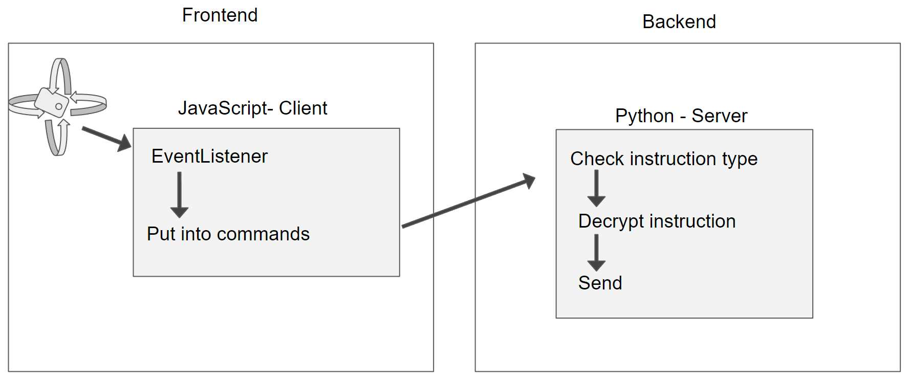

The gyroscope-control mainly uses the JavaScript eventlistener [deviceorientation](https://developer.mozilla.org/en-US/docs/Web/API/Device_orientation_events/Detecting_device_orientation) which returns alpha beta and gamma values. Depending on the devices orientation the movement instructions are calculatet for example like the following if the device is in portratit mode.
```javascript
if (beta > 105) {
    // For backward movemnt
    move += 2; // 2
} else if (beta > 0 && beta < 75) {
    // For forward movemnt
    move += 1; // 1
}
if (gamma < -15 && gamma > -75) {
    // For left movement
    move += 3; // 3 4 5
} else if (gamma < 75 && gamma > 15) {
    // For right movement
    move += 6; // 6 7 8
}
```
The calculated number represents one instruction set:
1. Forward
2. Backwards
3. Left
4. Forward and left
5. Backwards and left
6. Right
7. Forward and right
8. Backward and right

Afterwards this value is put in a list which uses the Canvas control format `["Gyro", moveIntention, printing]` and is send to the CanvasServer via HTTPRequest. The CanvasServer identifies based on the keyword *Gyro* if the instruction is such and calls the `sendCommandsToRobot`-function. Based on the instruction given it is then translated into ChalkBot command instructions and send to the ChalkBot.


The image above presents the dataflow in a compact form.