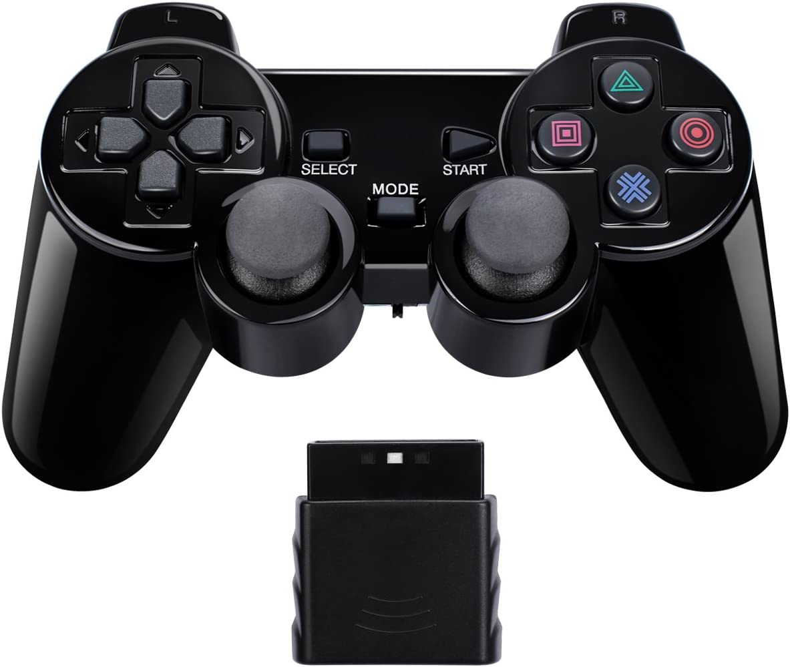
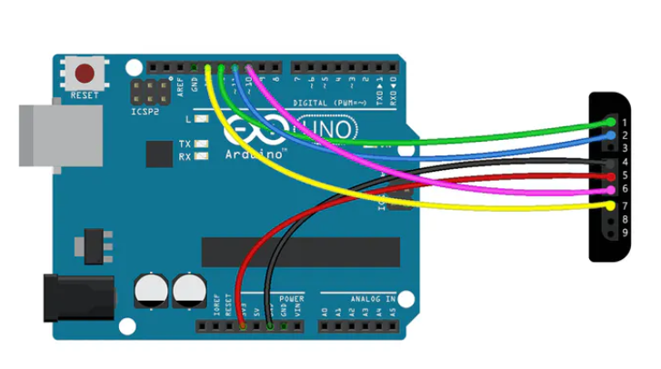
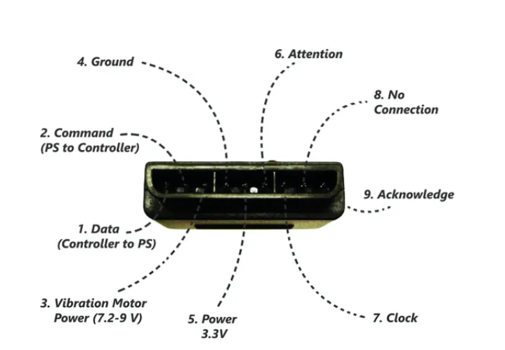

# PS2 controls through Arduino - Hardware Side
Below is a detailed documentation of the hardware components used to enable PS2 controls of the ChalkBot. 

This information is subject to change, for example, Arduino Mega will eventually replaced by the lighter Arduino Nano, etc.

# The controller

This project uses Blue Lake Performance Wireless PS2 Controller. The receiver component can connect to the target device through USB or classic PS2 pins.

## Controller connection to Arduino Mega
Jumper wires have been used to connect the pins on PS2 receiver to the Arduino Mega:

!!! Warning
    The receiver is fully powered through Arduino Mega through the corresponding pin, but this will not be possible in the later stages of the project, since Arduino Nano is unable to power up the receiver. An external power supply, such as batteries would have to be incorporated to implement this.

Below is a visual breakdown of the receiver pins for the PS2 controller:

## Arduino Mega connection to PC

Arduino Mega is connected to the PC through the USB port, which serves to power it up, as well as enable the serial input received by the Arduino to be read on the PC.

## Links and References
[PS2X_library.h](http://www.billporter.info/2010/06/05/playstation-2-controller-arduino-library-v1-0/comment-page-27/)

[Interfacing Tutorial](https://www.instructables.com/How-to-Interface-PS2-Wireless-Controller-W-Arduino/)
                
