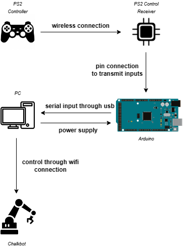

## PS2 controls through Arduino - Software Side
Below is the documentation of the software side of things. This will get updated as the project moves forward.

## Communication Diagram

## The Arduino Sketch

The Arduino sketch allows the Arduino to read the inputs that the PS2 Controller receives. The sketch uses the Arduino PS2 Library - PS2X_lib. The inputs of the PS2 Controller received serially by the Arduino, can be observed from the Serial Monitor of Arduino IDE, since our sketch instructs Arduino to print lines according to the inputs.

## The Python Program

The python program "ps2_control.py" responsible for receiving the input and sending it to the Chalkbot itself, or the simulator.

The serial library is imported, since it allows us to receive serial input. The serial instance - *serialInst* stores the serial data. This data is later read line by line as a part of the while loop.

D-pad buttons *up* and *down* are responsible for *forward* and *backward* *acceleration* respectively. D-pad buttons *left* and *right* are responsible for *left* and *right* *rotation* of the Chalkbot. Currently, the program uses the drive() function of the robot to perform these actions.

Actions initiated by pressing the D-pad buttons are done at the PWM determined by the pwm variable which is 50 initially. This value can be *increased* and *decreased* with the use of *R2* and *L2* buttons respectively.
