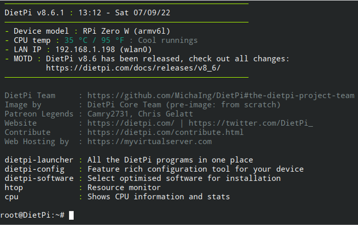

Diet Pi 
============

## Benefits

In the process of work, we came across another version of the operating system, which could facilitate the process of developing our application in a fairly detailed form. We present to your attention the operating system Diet Pi, which has a number of advantages over Raspberry Pi. 
It is an extremely lightweight Debian OS, highly optimised for minimal CPU and RAM resource usage, ensuring your SBC always runs at its maximum potential.

There several benefits of using Diet Pi:

- Minimalist Linux distribution for single-board computers
- As few packages as possible → fast startup
- Comes without a GUI by default
- Install desired software on first boot
- Simple operation via SSH
- SSH works out of the box
- Smaller RAM consumption than Raspberry Pi OS

Above all, users can quickly and easily backup or restore their DietPi system.
Using the DietPi-Services Control, user can control which installed software has higher or lower priority levels: nice, affinity, policy scheduler and more. Within the DietPi-Automation the user can completely automate a DietPi installation with no user input. Simply by configuring ***dietpi.txt*** before powering on.

Welcome screen after the connection over SSH: 

It takes 25s approximately for booting of the DietPi, which is more quick than the result of the RaspberryPi with 40s.

### Installation of DietPi OS
Please download the DietPi OS using the following [link](https://dietpi.com/).
