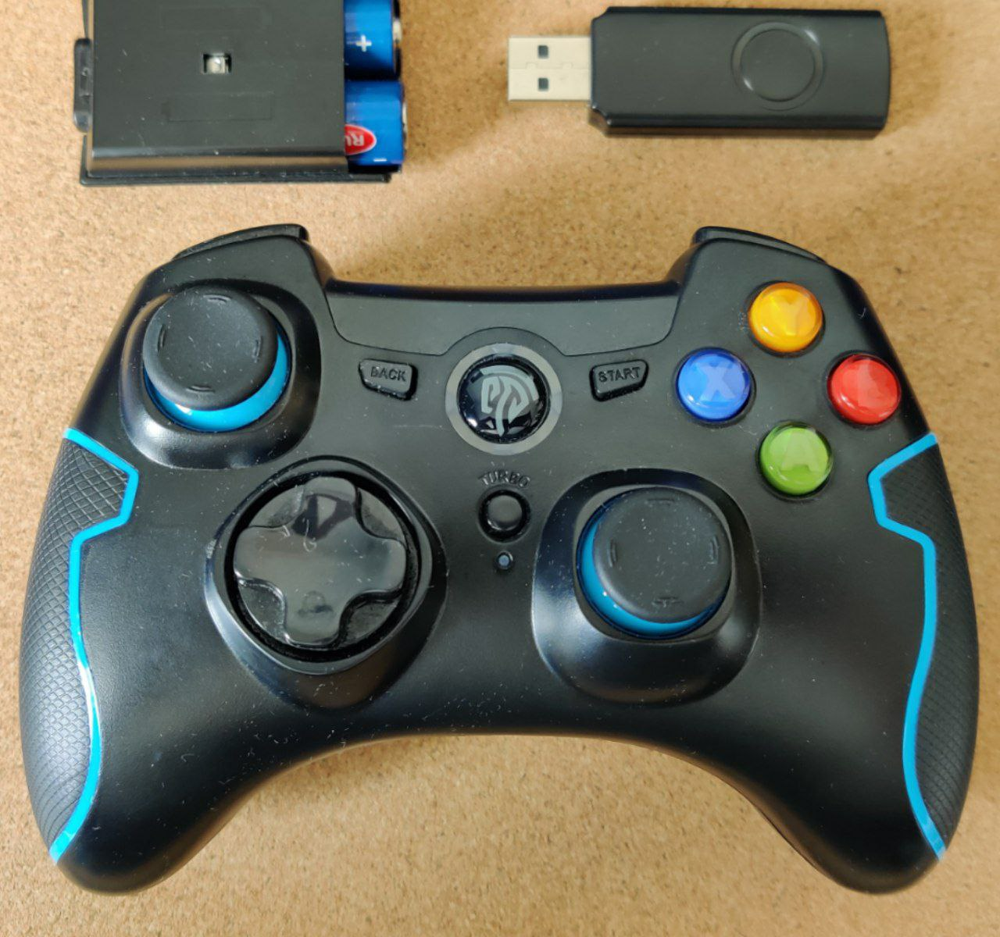
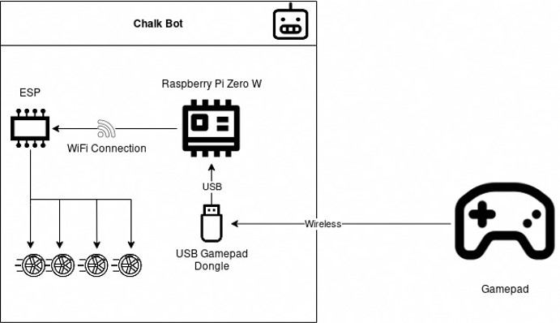
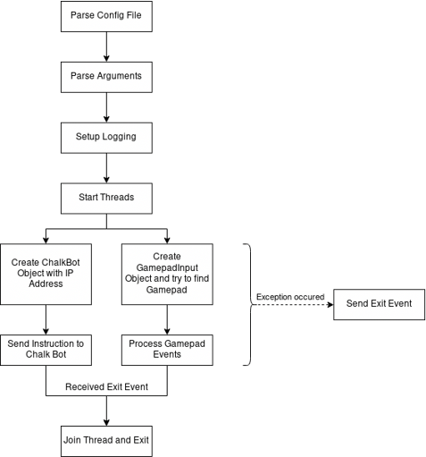
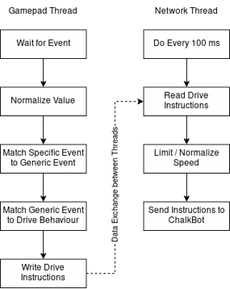
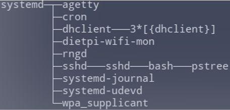

Gamepad Input Script
============

## Inputs Python Library

As a basis for developing our application, we use the ***Inputs Python Library***. The reason was the incredible flexibility and wide range of possibilities of this resource and a good feedback about the work from the community. All necessary information about the library can be pulled out of the following pages:

- [github/inputs](https://github.com/zeth/inputs)

- [zeth/inputs](https://inputs.readthedocs.io/en/latest/)

There are several reasons for using exactly this library:

- The Inputs module provides Python programs with an easy way to listen for user input.
- Currently supported platforms are Linux (including Raspberry Pi and Chromebooks in developer mode), Windows and the Apple Mac.
- Supported Python versions are all versions of Python 3 and Python 2.7
- Inputs is in pure Python and there are no Raspberry Pi, Linux or Windows dependencies.

It is also very useful when the device needs to run a particular application in full screen mode, but you would like to listen in the background for a certain set of user data, e.g. to bring up the admin panel in digital signage settings. But the most suffcient feature of the Iputs module is taht it is cross-platform, so it doesn't matter which you use, the event data will be normalized and your program will work the same on the other operating system.




### Installation


```bash
$ pip install inputs
```
or directly from source


```bash
$ git clone https://github.com/zeth/inputs.git
$ cd inputs
$ python setup.py install
```

As a concept of connecting the Gamepad controller with the Raspberry Pi within the ChalkBot Framework we used the following architecture:



We observe the connection with the USB Gamepad Dongle via wireless connection, the default requierement is to have the dongle preliminarily on the device. Te commands are being sent from the Raspberry Pi using wireless connection to the ESP-Module. 

## Implementation

- Written in Python
- Uses the ChalkBot Library
- 2 threads  (*Gamepad thread* & *Network Communication Thread*)
- Configuration via Config File and Command Line possible
- Logging with different levels in file

Gamepad thread
The reason we implemented multiple threads had several benefits as it is listed below:

- Support for any controller, one mapping per controller
- Support for multiple control schemes
– What happens if there are conflicting inputs?
- So e.g. forwards and backwards at the same time
- Maximum value is used
– Inputs Library does not support hotplug, i.e. USB dongle must be used with
program start

*Network Communication Thread* sends the current Drive Instructions to the ChalkBot every 100 ms with the ChalkBot Library.
*Error handling* reacts differently in various cases: 

- if a thread has an exception, sends exit event
- it also ends the other thread, if it can
- if it doesn't, it will be forced to quit

### Program flow plan

Flowing charts depicts the threading and decion making of the module by creating the associated object and sending instruction for the event. Handling of exceptions are also part of the default workflow.




### Core behavior 

Here under we observe the typical functional behavior of the implementation:



## Systemd / Autostart


*Image was taken from [www.systemd.io](https://systemd.io/)*

*Systemd* is a tool of basic building blocks for a Linux system. It provides a system and service manager that runs as PID 1 and starts the rest of the system. Systemd provides parallelization, uses socket and D-Bus activation for starting services, offers on-demand starting of daemons, keeps track of processes using Linux control groups, maintains mount and automount points, and implements an elaborate transactional dependency-based service control logic. systemd supports SysV and LSB init scripts and works as a replacement for sysvinit, starts first program running at boot, manages programs via services, it is actually the init process, i.e. PID 1,of a Linux system.




After starting and running the application the system reads the services written in the unit file of the program. The script takes configuration from config file (`/etc/default/chalkbot/gamepad_controller.conf`). The following file is located at `/etc/systemd/system/gamepad_controller_input.services`

```bash
[Unit]
Description=Provides the ability to control the robot with an USB Gamepad
After=network-online.target
Wants=network-online.target

[Services]
Type=simple
ExecStart=/usr/bin/python3 /usr/local/bin/gamepad_controller_input.py

Restart=always
RestartSec=1s

[Install]
WantedBy=multi-user.target
```


