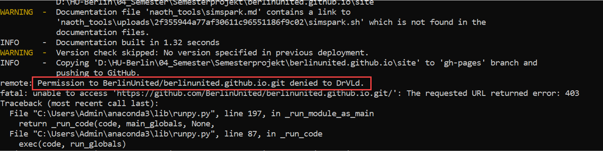

Problems & Solving
============

## Outline

As in any work, in ours everything was not entirely smooth and at times there were problems of various kinds that required a timely solution. At the same time, decisions should be within the clearly defined framework of the project itself, as well as respect for the competent allocation of resources.

All problems can be divided into the following three groups:

- SSH
- Git
- WiFi

### SSH

During the project we came across the error message while connecting the device over SSH, which was at some point a bit frustrative, since we couldn't figure out, what the error was caused. After several times of debugging, "stackoverlow"-ing and googling on different community forums, we found a way to solve the issue.There are actually three ways of solving the ssh error issue - desktop configuration, terminal configuration and *systemctl*. 
In case of desktop configuration, we should just go to the preferences and choose the Raspberry Pi configuration dialog. The next step is to go to the interfaces and click the ssh *enabled*, if it was not enabled before.

For terminal configuration we use well-known command:

```bash
$ sudo raspi config
```

Then choose the *Interfacing Options* on the dialog, subsequently navigating to the *SSH* and choosing OK. 

The last but not least was the SSH service *systemctl*


```bash
$ sudo systemctl enable ssh
```
```bash
$ sudo systemctl start ssh
```

For headless Raspberry Pi we have also a solution: so we need to adjust the
SSH file in Boot Partiotion of SD-Card, place the *username* & *password*. This procedure enables the SSH per default.
After enabling the SSH we need to establish the connection, but previously we need get also the ip-address of our Raspberry Pi. For the further connection we need just to type this command in the terminal:

```bash
$ ssh pi@<IP>
```
Instead of *IP* we need to put out ip-address of the Raspberry Pi. You are now remotely connected to the Raspberry Pi and can execute commands.
    


### Git

As in every project nowadays we used the version control system based on git-
tool and came across some permission error, that didn't let us push the 
changes from current files to the remote one. There was also some error
message we received:





The solution was revealed after some help from the team leader and that was associated with Windows Credential Manager, where some pre-configured settings blocked the push to the remote repository. After deleting these settings everything worked.


### WiFi Issues

There was also some problem with Raspberry Pi Zero WiFi, it was exceptionally poor when the device was moved. The problem had also the backdraw of using HTTP to communicate with ESP. Even if TCP connection is reused, one request takes 7 TCP packets, which means 70 packets per second. 

However, on the ChalkBot with the ESP, the connection seems quite stable, but should be best replaced with a wired connection.

We have investigated this particular isuue in a detailed manner and for that purpose we've measure the transfer rate between the Rasperry Pi and the computer.


Interval is 0.1 s, so a total of 10 seconds, so the one can observe clearly to see where the Raspberry Pi is moving.


## Outlook

- Switching ESP HTTP Server to support subsequently persistent connection
- Change communication protocol
- Avoid TCP connection, as there is too much overhead and FlowControl is undesirable (UDP e.g)
- This automatically eliminates HTTP
- Change config on the fly

