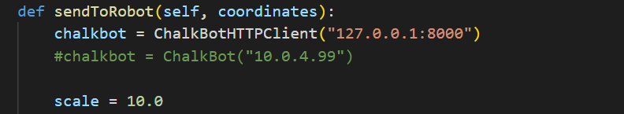
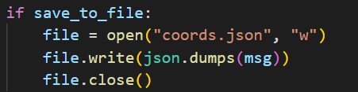
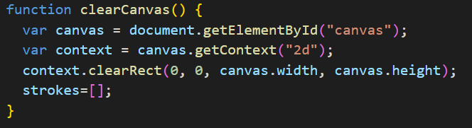
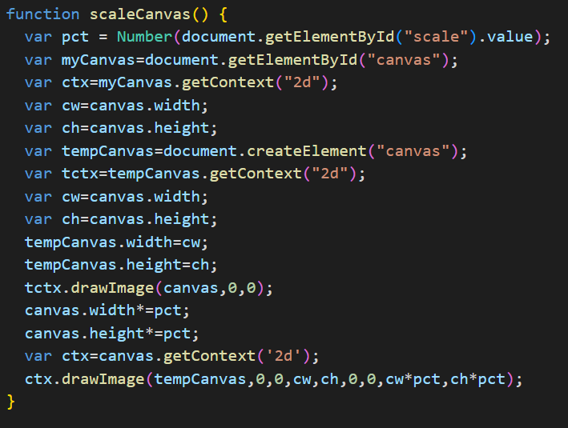
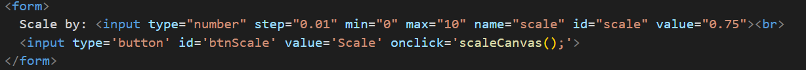
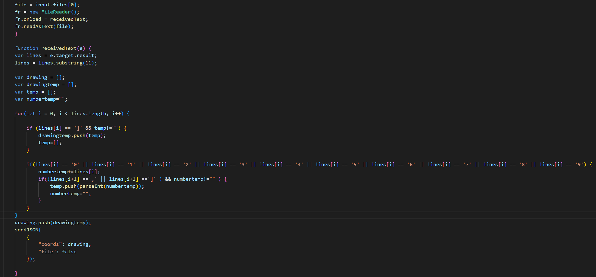

Since we learned how to use the simulator, I want to explain to you how the simulator and canvas work in the background.
When you draw a line in the drawing area several small blue arrows (as seen in the picture below) are created on that line. 

The x and y coordinates of these are stored in an array and get sent to the simulator or real life ChalkBot when you hit SEND. ChalkBot will then drive along those points and print the line. Every line you draw in the canvas is scaled by 10 to the real world. If you want to change if the simulator or ChalkBot should receive the coordinates, open CanvasServer.py in the canvas directory and move the hash from one to the other. The scaling is also changeable in this function.

SAVE TO FILE uses the same array of coordinates and just saves them to a file, the name of the file can be also changed in CanvasServer.py in the do_Post function as seen below.

CLEAR CANVAS removes all drawn lines by using the clearRect function by the canvas API, it also resets the array with the coordinates, because they would still be stored in the array otherwise after removing the drawn lines.

The scaling of the drawing area is done by the following code.

We just create a second canvas element and just copy all parameters from the previous canvas and then scale the height and width by the given value. The scale by button is implemented like this:

To load the saved file, we need to filter out the coordinates, that's done with the following code that removes all characters that are not important to draw the saved lines. 

Now the coordinates are just sent to the simulator in the same way they would have been if you drew the line in the drawing area.
