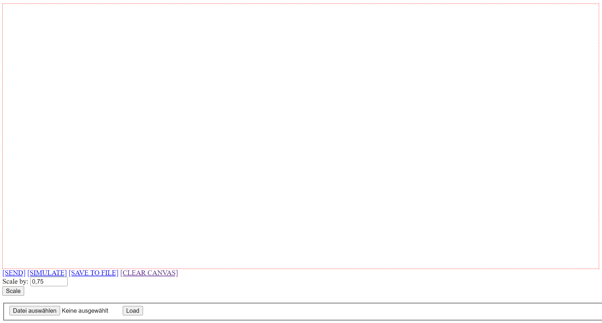
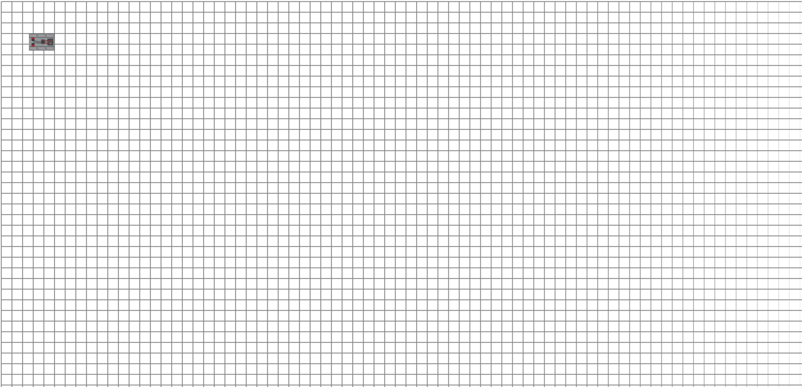
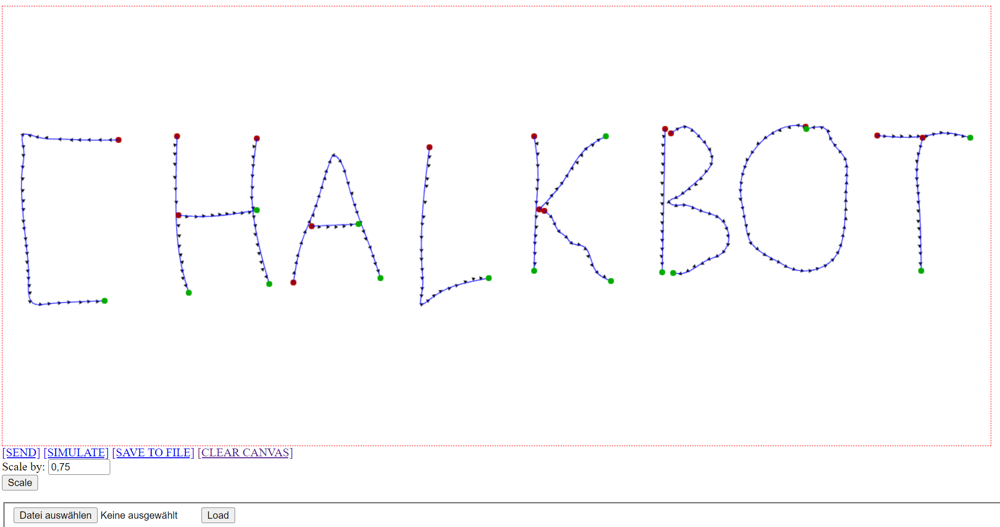
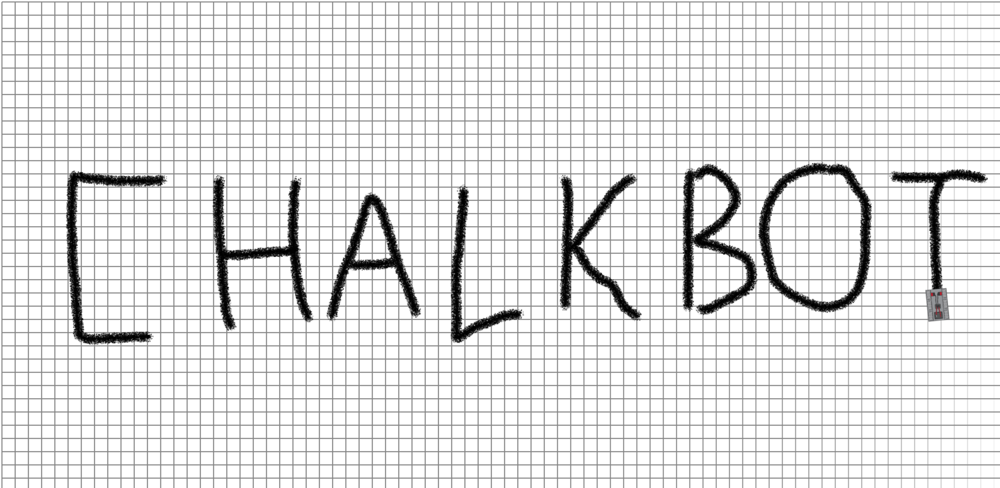
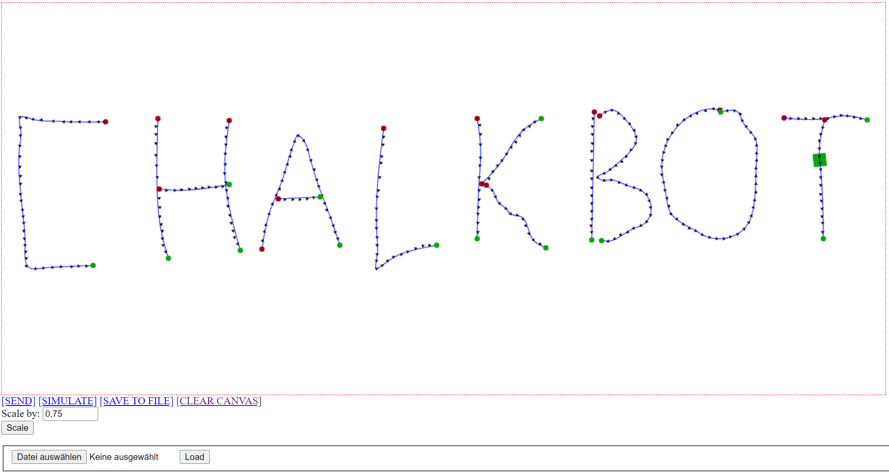
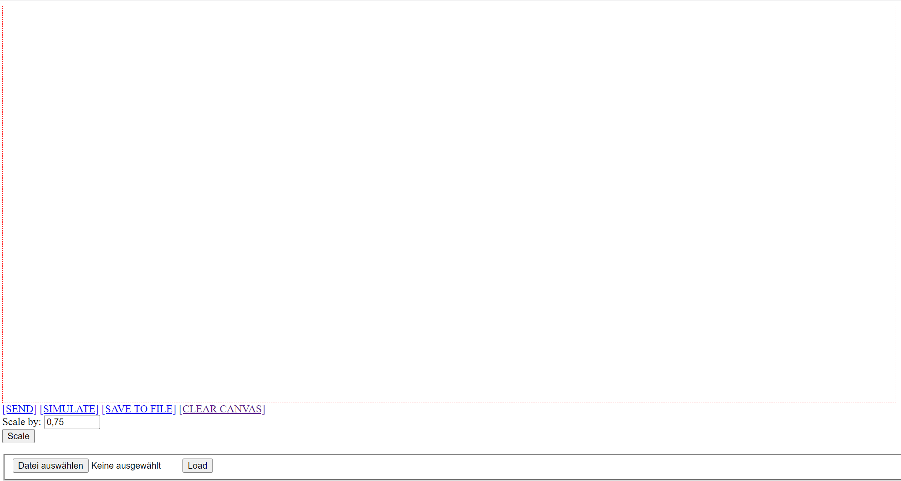

In this documentation of my work on the ChalkBot software, I want to introduce how the simulation server and the canvas server work and also how to use the functions of ChalkBot.

Since both servers are written in Python, you need to have python installed to use them. You also need to install three packages with the following command in the canvas and Simulation directory:

```bash
$ pip install -r requirements.txt
```

Now you are ready to start both servers by using 

```bash
$ python .\CanvasServer.py
```

in the canvas directory and

```bash
$ python .\Simulation.py
```

in the Simulation directory.

Both servers now run on your local device and can be reached with your browser at 
127.0.0.1:8800 for the canvas and 127.0.0.1:8080 for the simulation. It should look like this:

 	

Now let's get to the functions of canvas. You can draw a line or multiple lines using your mouse inside the red rectangle. 

	

When you hit “SEND”, the information is sent to the simulator and ChalkBot will print your drawn line.

	

“SIMULATE” simulates ChalkBot in the canvas as a green square.



In the case that you want to save your drawing to send it to ChalkBot in the simulation or to the real ChalkBot later, just hit “SAVE TO FILE” and your data is stored in a file called "coords.json" in the canvas directory. 

To load that file, you need to choose it on the bottom left. After you hit “Load” your data is sent to the simulator.

“CLEAR CANVAS” is useful when you want to erase your lines that you drew before and start from scratch.



The last option is to scale the drawing area to another size by inputting a number and then pressing “Scale”.

To close both servers just hit Ctrl+C in both terminals.
